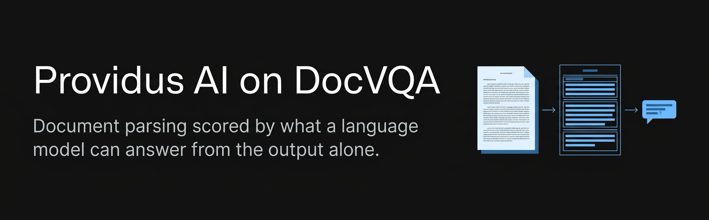

<p align="center">
  
</p>

<h1 align="center">Providus AI on DocVQA</h1>

<p align="center">
  <strong>Document parsing scored by what a language model can answer from the output alone. No image at answer time.</strong>
</p>

<p align="center">
  
  
  
  
  
</p>

<p align="center">
  <a href="https://platform.providus.ai/register">Try DocAI</a> •
  <a href="https://api.providus.ai/docs">API reference</a> •
  <a href="https://docs.providus.ai">Docs</a> •
  <a href="https://docs.providus.ai/mcp">MCP</a> •
  <a href="MISSES.md">Where the misses are</a> •
  <a href="NEXT_ITERATION.md">Next iteration</a>
</p>

DocVQA asks 5,349 questions about 1,286 real scanned documents: forms, letters, reports, tables, charts. (Two of them, document ids 4331 and 4386, are byte-identical page images, so the pipeline parses 1,285 unique pages.) It is normally used to score vision models that look at the page. We use it to score our parse output instead. The question-answering model in this benchmark never sees an image. It only sees the text and layout that Providus DocAI extracted from the page. If the answer is not in our output, the model cannot find it.

```
 PDF / scan            Providus DocAI                       QA model              Score
┌────────────┐   ┌──────────────────────────┐   ┌──────────────────────────┐   ┌───────────┐
│ 1,286 docs │ → │ layout → OCR → vision    │ → │ grounded chunks (text +  │ → │ ANLS /    │
│            │   │ markdown + grounding JSON│   │ boxes), no page image    │   │ exact     │
└────────────┘   └──────────────────────────┘   └──────────────────────────┘   └───────────┘
```

## Result

**Official ANLS 0.9066. Normalized exact match 88.3% (4,725 of 5,349).** May 2026 campaign result, DocVQA validation set, all 5,349 questions scored, none excluded.

| Metric | Value | Definition |
|---|---:|---|
| Official ANLS | 0.9066 | Standard DocVQA ANLS. Best normalized Levenshtein similarity over the accepted answers, zero below 0.5. |
| Normalized exact match | 88.3% (4,725) | Exact after lowercasing and removing punctuation, accents and extra spaces. |
| Case-insensitive exact match | 84.2% (4,506) | Exact after lowercasing and trimming only. |

Every number in this table is recomputed by `evaluate.py` from `results/predictions.jsonl`. The script exits non-zero if any value differs from what is written here, and it runs in GitHub Actions on every push (`.github/workflows/evaluate.yml`). `MISSES.md` lists where the remaining errors are and what fixes each group.

## Methodology

1. Each of the 1,285 unique page images is parsed by DocAI: layout detection, OCR, and a vision pass over figures and tables. The output is markdown plus a grounding JSON that lists every element with its page, bounding box and text.
2. For each question, the grounding is turned into chunks and the chunks most relevant to the question are placed in the QA model's context, up to 24,000 characters. The page image is never sent.
3. The QA model returns the shortest verbatim span that answers the question, or "not found". The prompt is in `prompt.md`.
4. Each prediction is scored against the accepted answers with official ANLS and with exact match. `evaluate.py` is the reference implementation of both.

## Configuration

| Role | Model |
|---|---|
| Layout | PP-DocLayoutV3 |
| OCR | glm-ocr@f16 (LM Studio) |
| Vision | qwen/qwen3-vl-30b (LM Studio) |
| QA | gpt-5.4-mini and gpt-5.4 (OpenAI), temperature 0, grounded context up to 24,000 characters, 128 output tokens |

DocAI runs the same pipeline against any OCR, vision or QA model you point it at, hosted or local. That is a design choice: an on-prem customer with no internet runs everything on one LM Studio box, and the cloud service uses hosted models. Every result we publish names the models that produced it.

## Test it on your own documents

A benchmark number tells you how we do on DocVQA's documents. The number that matters is how we do on yours. The same pipeline behind this result is the one behind the DocAI API, so you can run your own bake-off in an afternoon.

Create an account at https://platform.providus.ai/register. New organizations start with trial credits. An organization admin creates a key under Settings, API Keys. Requests carry it in the `x-api-key` header. Questions, larger evaluations or an on-prem trial: hello@providus.ai.

Create a knowledge base, or list the ones you have:

    curl -s https://api.providus.ai/v1/knowledge-bases \
      -H "x-api-key: $DOCAI_API_KEY"

Upload a document and parse it in one call:

    curl -s https://api.providus.ai/v1/files \
      -H "x-api-key: $DOCAI_API_KEY" \
      -F file=@your-document.pdf \
      -F kb_id=$KB_ID \
      -F auto_parse=true

The response includes the file id and the parse job. When the job completes, list the artifacts and fetch the markdown and the grounding JSON (every element with its page, bounding box and text):

    curl -s https://api.providus.ai/v1/files/$FILE_ID/artefacts \
      -H "x-api-key: $DOCAI_API_KEY"

    curl -s https://api.providus.ai/v1/artifacts/$MANIFEST_ID/$ARTIFACT_KEY \
      -H "x-api-key: $DOCAI_API_KEY"

Feed the markdown to the QA model of your choice with `prompt.md` and you have reproduced this benchmark's setup on your own files. Score with your own answer key; `evaluate.py` shows the exact normalization we use.

The interactive API reference is at https://api.providus.ai/docs and the product documentation at https://docs.providus.ai (file upload and processing: https://docs.providus.ai/api/files and https://docs.providus.ai/api/file-processing). If you work from a coding agent, the DocAI MCP server exposes upload, parse, extract, classify, split and search as tools. Setup for Claude Code, Cursor and Codex is at https://docs.providus.ai/mcp; in Claude Code it is `/plugin marketplace add ProvidusAI/docai-plugins` then `/plugin install docai`, with `DOCAI_API_KEY` set.

Running on your own hardware: the on-prem installer is a versioned script with a published checksum. Download it, verify it, read it, then run it:

    curl -fsSLO https://providus.ai/deployment.sh
    curl -fsSLO https://providus.ai/deployment.sh.sha256
    shasum -a 256 -c deployment.sh.sha256      # sha256sum -c on Linux
    sh deployment.sh

It installs the same stack on macOS, Linux or Windows with local models; the release bundle and its checksum are at `https://providus.ai/bundles/docai-onprem-<version>.zip` and `.zip.sha256`. On-prem installs point `DOCAI_BASE_URL` at their own instance and everything above works unchanged.

## Dataset

DocVQA validation split, 5,349 questions over 1,286 documents (1,285 unique page images; document ids 4331 and 4386 share one). We read it from the Hugging Face mirror `lmms-lab/DocVQA` (config `DocVQA`, split `validation`). The images are not stored in this repo; the script below downloads about 1 GB into `data/docvqa/`:

    pip install -r requirements-download.txt
    python scripts/download_docvqa.py

It writes one PNG per document, `annotations.jsonl` with the questions and accepted answers, and `hashes.json`, which maps each `docId` to the 12-character `img_hash` used in `results/predictions.jsonl` (md5 of the PNG bytes). The official distribution is through the RRC portal at docvqa.org under its own terms; the mirror lists apache-2.0.

## Repository structure

    .
    ├── README.md
    ├── MISSES.md                 where the remaining errors are and what fixes each group
    ├── NEXT_ITERATION.md         protocol for the next run
    ├── prompt.md                 the QA system prompt
    ├── evaluate.py               standalone scorer (official ANLS, exact match)
    ├── requirements.txt          editdistance, requests
    ├── requirements-download.txt datasets, pillow (dataset download only)
    ├── assets/banner.png
    ├── scripts/
    │   ├── derive_predictions.py     builds results/predictions.jsonl from the campaign artifact
    │   ├── download_docvqa.py        step 1: dataset to data/docvqa/
    │   ├── parse_with_docai.py       step 2: every page through the DocAI API to parsed/
    │   └── run_qa.py                 step 3: QA over the parsed markdown, one pass
    ├── results/
    │   ├── predictions.jsonl         the published run, 5,349 rows
    │   ├── SHA256SUMS
    │   └── runs/<run-id>/            your own runs (not committed)
    ├── data/docvqa/                  dataset (not committed)
    │   ├── annotations.jsonl
    │   ├── hashes.json
    │   └── images/{docId}.png
    └── parsed/{img_hash}/            DocAI output per page (not committed)
        ├── result.md
        └── grounding.json

## Reproduce

Two levels. The first checks our published numbers and takes a few seconds. The second re-runs the benchmark end to end with your own DocAI key and QA model.

### 1. Verify the published table

    pip install -r requirements.txt
    python evaluate.py

`evaluate.py` recomputes every metric from `results/predictions.jsonl` and exits non-zero if any value differs from the table above. `results/SHA256SUMS` covers the predictions file.

### 2. Run the benchmark yourself

Step 1, dataset (about 1 GB):

    pip install -r requirements-download.txt
    python scripts/download_docvqa.py

Step 2, parse every page with DocAI. Create an account at https://platform.providus.ai/register, make a key under Settings, API Keys, and create a knowledge base to hold the pages (`POST /v1/knowledge-bases` or the app). Then:

    pip install -r requirements.txt
    export DOCAI_API_KEY=...
    export DOCAI_BASE_URL=https://api.providus.ai     # or your on-prem instance
    python scripts/parse_with_docai.py --kb-id <knowledge base id>

Each page is uploaded with `auto_parse=true`; the script waits for the job and saves `result.md` and `grounding.json` under `parsed/{img_hash}/`. It skips pages that are already parsed, so it can be stopped and resumed. Parsing is per unique image, so the full set costs 1,285 parse credits.

Step 3, answer the questions from the parsed markdown alone and score:

    export QA_API_KEY=...
    export QA_BASE_URL=https://api.openai.com/v1      # any OpenAI-compatible endpoint
    python scripts/run_qa.py --model openai/gpt-5.6-luna --run-id luna-baseline
    python evaluate.py results/runs/luna-baseline/predictions.jsonl

The QA model receives `prompt.md` as the system prompt and the full `result.md` of the page as the user message, temperature 0, 128 output tokens. It never receives the image. The run writes `results/runs/<run-id>/predictions.jsonl` in the same shape as the published file plus a `run.json` with the model and endpoint, and `evaluate.py` prints the same table for it. This is the protocol in `NEXT_ITERATION.md`: one configuration, one pass, official scoring.

Try a small slice first: every script accepts `--limit N`.

## Data format

One JSON object per line in `results/predictions.jsonl`, sorted by `question_id`:

| Field | Type | Meaning |
|---|---|---|
| `question_id` | string | DocVQA question id |
| `doc_id` | integer | DocVQA document id |
| `img_hash` | string | Short hash of the page image, stable across runs |
| `question` | string | The question as asked |
| `answers` | list of strings | Accepted answers from the dataset |
| `pred` | string | DocAI plus QA model prediction |
| `official_score` | float | Official ANLS for this row, 0 to 1 |
| `internal_score` | float | Score from the campaign's internal repair-loop scorer, 0 to 1. Kept for the record; not a reported metric |
| `exact_ci` | boolean | Case-insensitive exact match |
| `exact_normalized` | boolean | Exact match after normalization |
| `diagnostic` | string | Miss category used in `MISSES.md` |

---

<p align="center">
  Built by <a href="https://providus.ai">Providus AI</a>. Questions and evaluations: <a href="mailto:hello@providus.ai">hello@providus.ai</a>
</p>
